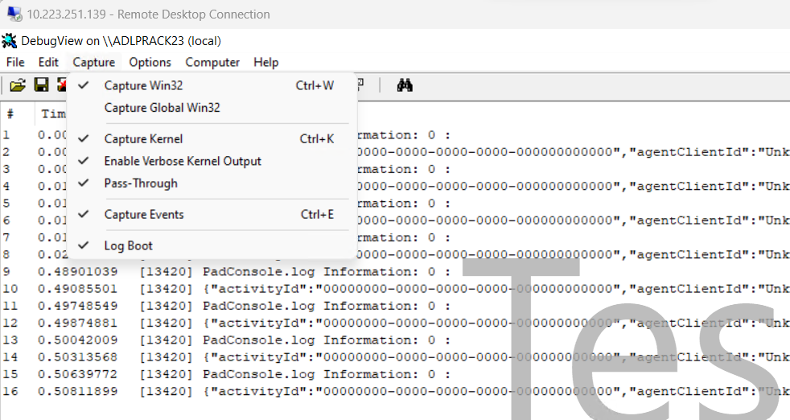
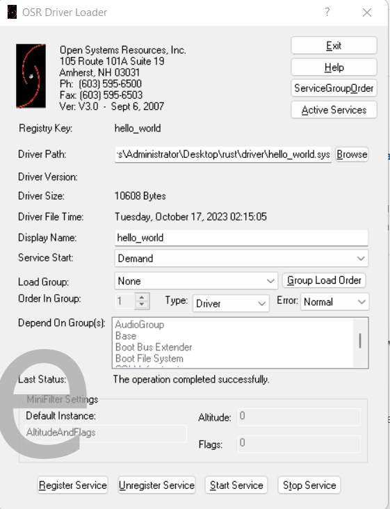
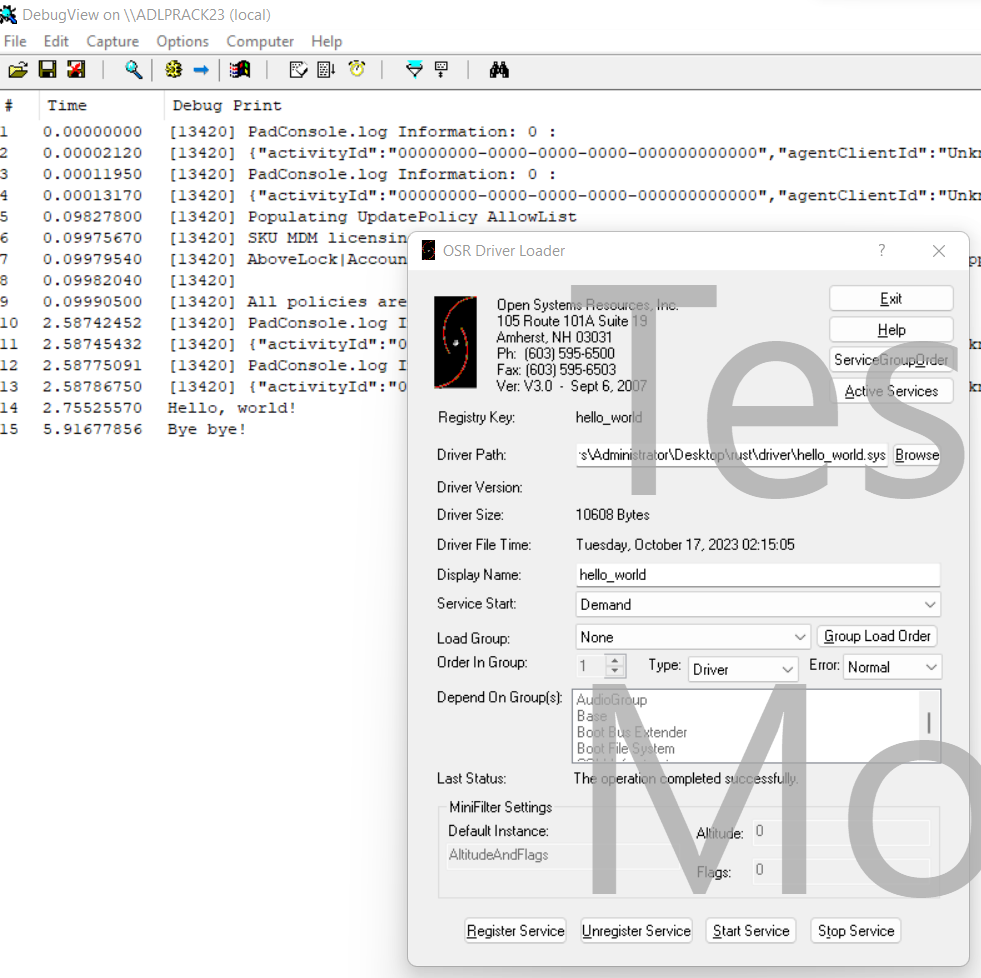

This git repo is a fork from https://github.com/StephanvanSchaik/windows-kernel-rs. 
Thanks to StephanvanSchaik for his excellent work through the above repo. 

I had encountered few compilation issues while trying to compile the hello-world
sample driver code and fixed them as part of commits to this forked git repo. 

In this document I have put together the best know methods / steps 
to successfully build, load and test the hello world driver.

Pre-requisites:
---------------

1. Build environment setup
--------------------------
These steps should be performed on your development system for setting up the build environment for windows drivers development using rust.

1a. Set up EWDK Build Environment

    Install the latest version from link
    https://learn.microsoft.com/en-us/legal/windows/hardware/enterprise-wdk-license-2022
    Expand the ISO image to c:\ewdk

    Start Environment by running in command prompt:
    c:\ewdk\LaunchBuildEnv.cmd

    The ISO image of the ewdk can be downloaded directly using this link https://go.microsoft.com/fwlink/?linkid=2237475

1b. Install clang by running the following command from the windows command prompt.

    winget install LLVM.LLVM
1c. Install rust by following the instructions in link https://www.rust-lang.org/tools/install 
    This will install the rust stable build. But for building the windows drivers using rust we need nightly build of rust compiler tools. 

1d. Install the rust nightly build using the following command

    rustup toolchain install nightly-msvc

1e. Set the nightly build version of rust compiler toolchain as the default tool chain using following command

    rustup default nightly-msvc

1f. Run the below command for additional setup process required for build environment 
    
    cargo install cargo-make --no-default-features --features tls-native

    This is required for using the makefile.toml files for capturing the build steps.

1g. Run the below command as additional optional steps (optional step as per https://github.com/microsoft/Windows-rust-driver-samples)
    
    cargo install cargo-expand cargo-edit cargo-workspaces

2. Test environment setup
-------------------------
The below steps needs to be performed on the test system aka System Under Test(SUT)

2a. From adminstrator windows command prompt run the below command to enable testsigning 
    
    Bcdedit.exe -set TESTSIGNING ON

    Once your testing is done, you can disable testsigning by using the command `Bcdedit.exe -set TESTSIGNING OFF`

2b. shutdown and reboot the system for the above setting to take effect

Build steps:
------------
The below steps needs to be run from your development system.
Assuming that the development system and the test system are 2 different systems.

1. Clone the git repo using the command below

    git clone https://github.com/jpshivakavi/windows-kernel-rs.git

2. Change your working directory to hello-world

   cd hello-world

3. Build the driver using the command below

   cargo build

   The above step builds the driver in the form of a .dll file (hello_world.dll). 
   This should be renamed with .sys extension and then the driver needs to be signed.

4. Use the command below to rename the driver from .dll to .sys and sign it with selfsigned certificate

   cargo make sign 

Test steps:
-----------
The below steps needs to be performed on the test system
1. Install the DbgViewer using the below link

   https://download.sysinternals.com/files/DebugView.zip
   It downloads the Dbgview.zip to Downloads folder.
   Unzip the Dbgview.zip folder and launch dbgview64.exe with administrator privileges

2. Ensure that the following menu options are enabled in the DbgView application

   DbgView:Capture->Capture Kernel 
   DbgView:Capture->Enable Verbose Kernel Output

   

3. Download and unzip the osrloader GUI application using the link below 
   https://www.osronline.com/OsrDown.cfm/osrloaderv30.zip%5Ename=osrloaderv30.zip&id=157

   Locate the OSRLOADER.exe under unzipped folder osrloaderv30\Projects\OsrLoader\kit\WLH\AMD64\FRE
   Run the OSRLOADER.exe with administrator privileges

3. Copy the hello_world.sys file from the development system to the test system (system under test) 

   You may use Remote Desktop connection from your development system to test system 
   or
   Use an external USB thumb drive for copying the .sys file

4. From the OSRLOADER GUI as shown below, click on Browse button against the Driver Path text box
   Select the folder where the hello_world.sys file is located
   
   
   
5. Click on Register Service button located on the bottom left side of the OSRLOADER GUI Application

6. Click on Start Service button and Stop Service button in that order 
   located on the bottom of the OSRLOADER GUI application.

   You should see Hello, World! and Bye bye! strings appearing on the DbgView GUI application as shown below
   
   